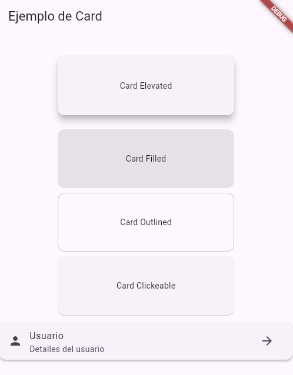

# 🚀 Flutter Card Exercise

[](https://flutter.dev)

[](LICENSE)



## 📚 Descripción

Este proyecto está diseñado para explorar y experimentar con el widget Card en Flutter. El objetivo principal es entender cómo utilizar Card para crear componentes visuales con sombras, bordes y comportamiento interactivo.

## 🎯 Objetivo del Proyecto

- Aprender las distintas variantes del widget `Card` (normal, filled, outlined).
- Entender cómo personalizar `Card` con bordes, sombras, y estilos.
- Implementar tarjetas interactivas mediante `InkWell`.
- Practicar con ejemplos prácticos de uso, como listas y tarjetas clickeables.

## 🛠️ Características

- **Variedades del Widget Card:** Incluye ejemplos de `Card`, `Card.filled` y `Card.outlined`.

- **Tarjetas Interactivas:** Tarjetas que responden a clics utilizando `InkWell`.

- **Personalización Visual:** Control de bordes, sombras y márgenes mediante propiedades como `clipBehavior`, `elevation` y `margin`.

- **Integración con Widgets Compuestos:** Uso de Card en combinación con widgets como `ListTile` para construir UI más complejas.

## 📂 Estructura del Proyecto

```plaintext
lib/
├── main.dart
```

## 🚀 Cómo Ejecutar el Proyecto

1. Asegúrate de tener Flutter instalado en tu sistema. Si no, sigue las instrucciones en la [documentación oficial](https://flutter.dev/)

2. Clona este repositorio:

```bash
git clone https://github.com/DevmenteSac/flutter_cards
```

3. Navega al directorio:

```bash
cd flutter_cards
```

4. Instala las dependencias:

```bash
flutter pub get
```

5. Ejecuta la aplicación:

```bash
flutter run
```

## 🧰 Herramientas Usadas

- **Flutter SDK:** Framework
- **Dart:** Lenguaje de Programacion
- **VS Code:** Entorno de Desarrollo
- **Android Studio:** Emulador

## 📖 Lo que He Aprendido

- Primero se usa `Card`, luego se usa `InkWell` para interactividad y despues `SizedBox` para el tamaño.

- Diferencias entre las variantes de Card: normal, filled, y outlined.

- Uso de propiedades como clipBehavior para recortar contenido que excede los límites de la tarjeta.

- Cómo hacer tarjetas clickeables y mejorar la experiencia de usuario.

- Aplicaciones prácticas del widget Card en interfaces cotidianas.

## 📋 Próximos Pasos

- Añadir animaciones a las tarjetas, como transiciones con Hero.

## 🤝 Contribuciones

Este proyecto es principalmente para aprendizaje personal, pero siéntete libre de proponer mejoras o sugerencias.

## 📞 Contacto
Devmente Sac - [devmentesacontacto@gmail.com](mailto:devmentesacontacto@gmail.com)  
GitHub: [DevmenteSac](https://github.com/DevmenteSac)